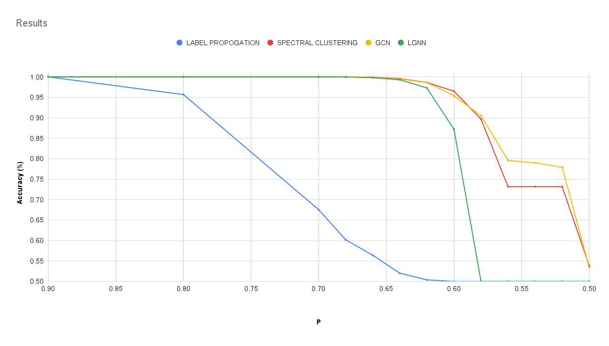

# Community Detection: GNNs vs. Traditional Algorithms

This project compares the performance of Graph Neural Networks (GNNs) with traditional non-learning-based methods for community detection in complex networks.

## Project Overview

We implemented and evaluated several community detection methods:

- Label Propagation
- Spectral Clustering
- Graph Convolutional Network (GCN)
- Line Graph Neural Network (LGNN)

These methods were tested on synthetic datasets generated using the Stochastic Block Model (SBM).

For a detailed explanation of our methodology and findings, please refer to our [project book](metadata/project_book.pdf).

## Main Results



The graph shows the accuracy of different community detection methods on networks generated using the Stochastic Block Model. We varied intra-community (p) and inter-community (q) connection probabilities, where 0.5 < p < 0.9 and q = 1 - p. GNN-based methods (GCN and LGNN) maintain high accuracy even as community structure becomes less distinct, outperforming traditional methods in challenging scenarios.

## Project Structure

- `lgnn/`: Implementation of Line Graph Neural Network
- `label-propagation/`: Implementation of Label Propagation algorithm
- `gcn/`: Implementation of Graph Convolutional Network
- `metadata/`: Contains project book, project documentation and result visualizations

## Requirements

To run the code in this project, you'll need the following libraries:

- PyTorch
- PyTorch Geometric (for GCN)
- Deep Graph Library (DGL) (for LGNN)
- NetworkX
- NumPy
- Matplotlib
- Scikit-learn (for Spectral Clustering)
- Karate Club Library (for Label Propagation)

## Running the Code

To run the code, you can use the following command:

For the Line Graph Neural Network:

```bash
python lgnn/train_lgnn.py
```

For the Graph Convolutional Network:

```bash
python gcn/train_gcn.py
```

For the Label Propagation algorithm and Spectral Clustering:

```bash
python label-propagation/run_label_propagation.py
```

## Contributors

Ben Dabush
Naama Shiponi
Arad Ben Menashe
